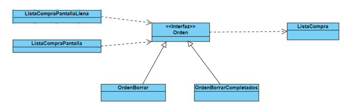

# Lista de la compra

Este proyecto ha sido entregado como práctica final de la asignatura *desarrollo de software para dispositivos móviles*

Esta aplicación es una sencilla lista de la compra, con la que podremos:

- Añadir productos, a los que se le podrá asignar un nombre, una unidad de medida y una cantidad.
- Borrar productos.
- Editar un producto.
- Marcar un producto como comprado.
- Borrar los productos que ya hayan sido marcados como comprados.
- Deshacer cambios.

```xml
<table>
  <tr>
    <td>Página inicial</td>
     <td>Añadir/borrar producto</td>
     <td>Deslizar para editar</td>
     <td>Deslizar para borrar</td>
  </tr>
  <tr>
    <td></td>
    <td></td>
    <td></td>
    <td></td>
  </tr>
 </table>
```

Vamos a indagar un poco en el proceso de desarrollo de la aplicación.

## Diseño de la interfaz

El objetivo de nuestra aplicación ha sido crear una interfaz lo más sencilla, que recuerde a un papel.


## Arquitectura de la interfaz

Es importante ver como se comunican las distintas pantallas de nuestra aplicación.


## Patrones de diseño

Para implementar ciertas acciones, como el deshacer o la navegación entre pantallas, se ha hecho uso de diferentes patrones de diseño para hacer el código más orgánico.

### Patrón command

Este patrón implementa el comando deshacer de manera sencilla, he aquí un diagrama de clases que ilustra el diseño de este patrón enfocado a nuestra aplicación:



En este caso, tenemos como invocadores a la _ListaCompraPantallaLlena_ y a la clase _ListaCompraPantalla_, las cuales son las únicas clases con capacidad de borrar elementos de la lista. 

El único receptor, por tanto; es la clase _ListaCompra_, la cual guarda el estado de los elementos de la lista tanto en el fichero de texto como a nivel de estructura de datos. 

Las órdenes que se implementan son dos, la _OrdenBorrar_ se ejecuta cuando se va a borrar una única línea de la lista. _OrdenBorrarCompletados_ se ejecuta cuando se va a borrar al menos un elemento marcado como completado.

### Patrón singleton

Usado en el patrón deshacer, en la clase UndoManager. En esta clase se crea una instancia de la propia clase, siendo única y general para toda la app. Esto tiene sentido ya que la acción deshacer se implementa mediante dos pilas las cuales guardan cualquier acción de la app que pueda ser deshecha, por ello no sería conveniente tener varias instancias de esta clase, sino sólo una que administre todas estas acciones.

### Patrón estado

Para nuestra lista los cambios se producen en la vista de añadir producto, donde añadimos o editamos productos de la lista, y los consumimos en la vista de pantalla llena. Para ello necesitamos el patrón estado, el cual se implementa con el mecanismo _provider-consumer_. 

Tenemos cuatro conceptos importantes:

- **ChangeNotifier**: Clase que tiene el estado mutable, es decir, que cambia. En nuestro caso será la clase _ListaCompra_, la cuál tendrá la lista de la compra en sí y operaciones para cambiarla. En cada una de las operaciones llamaremos a _notifyListeners()_, para que los observadores sepan que el estado mutable ha cambiado y obtengan los cambios.
- **ChangeNotiferProvider**: Quien da acceso al estado mutable a las vistas que lo necesiten. Lo creamos en la clase principal, _ListaCompraApp_, asociándole el contexto de la aplicación.
- **Consumer**: Escuchan los cambios que se producen en _ListaCompra_. En nuestra aplicación, la clase _PaginaPrincipal_, con la cual elegimos si mostrar la vista de pantalla llena o vacía.
- **Provider.of**: Sirve para acceder al estado mutable pero sin escuchar los cambios. Los usamos en _PaginaPrincipal_ para llamar a ciertos métodos.

## Diagramas de clases

Las clases se han modelado de la siguiente forma:

Para las pantallas:


Para el modelo de datos:


Para el comando deshacer:


